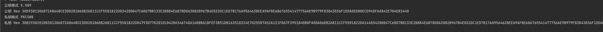
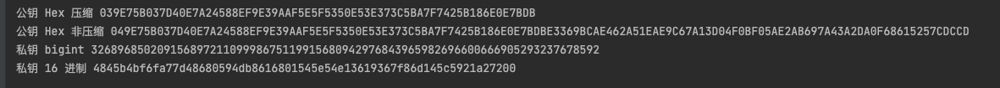

# bouncycastle 包的使用

[bc 包仓库](https://mvnrepository.com/artifact/org.bouncycastle/bcprov-jdk15on)

## 环境/配置

IntelliJ IDEA 2021.3.3 (Community Edition)

gradle-7.1.1

org.bouncycastle:bcprov-jdk15on:1.69

---
2023-06-19

## SM2 秘钥对生成
> 本章包含两种 SM2 秘钥对生成逻辑: KeyPair, AsymmetricCipherKeyPair

[SM2 工具类](src/main/java/util/SM2Util.java)

### KeyPair 

> 利用 bc 包的 `BouncyCastleProvider` 生成 JDK 中的 `KeyPair` 对象

[Demo](src/main/java/Demo.java)

**总结**:

- 利用了 bc 包的 `BouncyCastleProvider` , 生成的是 JDK 自带的 `KeyPair` 对象
- `KeyPair` 包含公私钥对象, 可以查看 format 和 byte[]
- 公私钥的 byte[] 直接转 String 输出是乱码, Demo 中经过 Hex 编码后输出
- 公私钥的开头部分是固定的: 公钥(Hex): 305930 开头, 私钥(Hex): 308193 开头
- 私钥长度 > 公钥长度

KeyPair 的公私钥对象, 基本信息举例(Hex 编码后输出):

### AsymmetricCipherKeyPair

[Demo](src/main/java/Demo.java)

**总结**:

- 全部依赖于 bc 包 API 生成
- 公钥采用 x y 坐标格式(包含两个 bigInt), 私钥本质是一个 bigint
- 私钥长度 < 公钥长度
- 可以获取公钥的压缩/非压缩 byte[], Hex 编码后分别以 03(压缩) 和 04(非压缩) 开头
- 生成的公私钥格式兼容性更强(某些平台生成公钥就是 Hex 编码的非压缩格式)

例子:

## byte[] 转为公私钥对象

# 待办
- byte[] 转秘钥对象
- ecdh 秘钥协商
- sm4 加解密

